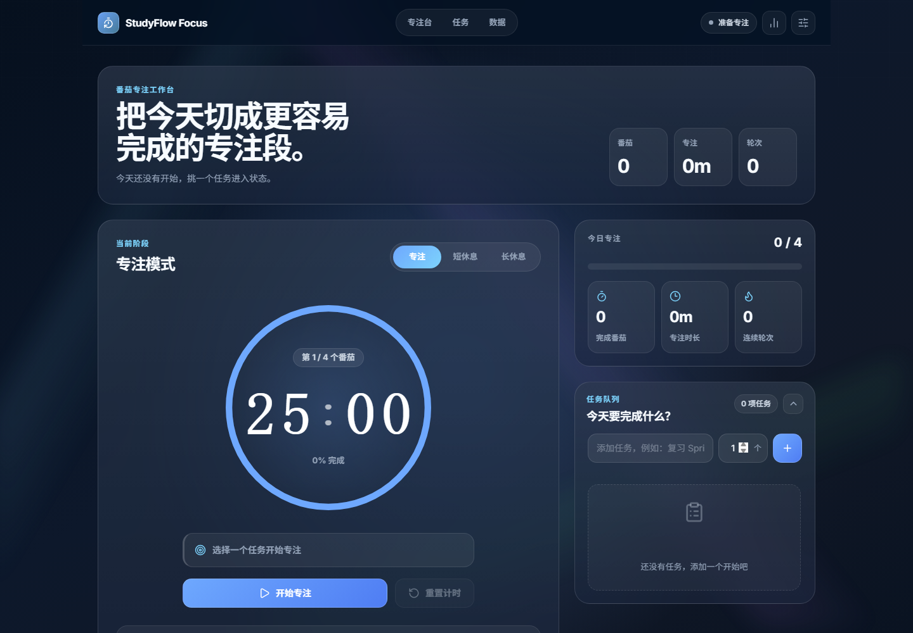
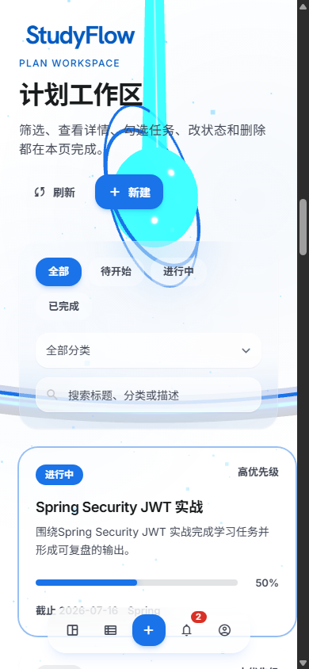

# StudyFlow 学习计划管理系统

StudyFlow 是一个面向个人学习目标管理的全栈项目。项目把用户认证、数据权限、计划与任务管理、统计缓存、到期提醒、数据库迁移、自动化测试和容器化部署串成一个完整业务闭环。

## 在线演示

- Netlify 静态演示：<https://studyflow-berry9429ee.netlify.app>
- 推荐账号：`demo` / `user123`

Netlify 不能运行 Spring Boot，因此线上地址采用浏览器演示后端：登录、计划、任务、统计和提醒数据保存在当前浏览器的 `localStorage` 中。它用于快速体验交互，不代表真实生产后端；本地 Docker 环境运行的是完整 Spring Boot + MySQL + Redis 架构。

## 项目截图

| 桌面端仪表盘 | 移动端适配 |
| --- | --- |
|  |  |

## 技术栈

- 后端：Java 17、Spring Boot 3.2、Spring Security 6、JWT、MyBatis-Plus、MapStruct
- 数据：MySQL 8.0、Redis、Flyway
- 前端：HTML5、Tailwind CSS、Vanilla JavaScript ES Modules、Three.js
- 工程：Maven、JUnit 5、Mockito、Node Test Runner、Docker Compose、GitHub Actions
- 文档：Knife4j、Swagger OpenAPI

## 架构

```text
Browser
  -> Static SPA / HTTP JSON
  -> Spring Security + JwtAuthFilter
  -> Controller
  -> Service + Transaction
  -> MyBatis Mapper
  -> MySQL

DashboardService -> Redis cache
PlanReminderService -> NotificationService -> MySQL
```

项目采用模块化单体架构。当前业务规模下，模块化单体比微服务更容易部署、调试和保持事务一致性，也足以展示后端分层、鉴权、缓存和任务调度能力。

## 核心功能

- 用户注册、登录、BCrypt 密码加密、JWT 无状态认证
- 计划分页查询、关键词搜索、分类筛选和状态筛选
- 计划新增、编辑、删除以及任务清单管理
- 根据任务完成情况自动计算进度并归一化计划状态
- 按当前用户隔离计划、任务、提醒和统计数据
- Redis 缓存仪表盘统计，业务变更后主动失效缓存
- 定时扫描即将到期和已逾期计划，唯一业务键保证提醒幂等
- Flyway 管理表结构，开发演示数据与生产迁移分离
- Netlify 静态演示模式与真实 Spring Boot API 模式分离
- GitHub Actions 自动运行 Java 测试、JavaScript 语法检查和演示后端测试

## 快速启动

### Docker Compose

需要安装 Docker Desktop：

```bash
docker compose up --build
```

启动后访问：

- 应用：<http://localhost:8080>
- Knife4j：<http://localhost:8080/doc.html>
- OpenAPI：<http://localhost:8080/v3/api-docs>

开发环境会通过 Flyway 自动创建表结构并导入演示数据。如需重新初始化：

```bash
docker compose down -v
docker compose up --build
```

### 本地 Maven

需要 JDK 17、Maven 3.8+、MySQL 8.0 和 Redis 6+。

```sql
CREATE DATABASE studyflow CHARACTER SET utf8mb4 COLLATE utf8mb4_unicode_ci;
```

复制 `.env.example` 并设置本机环境变量，然后运行：

```bash
mvn spring-boot:run
```

默认启用 `dev` profile。开发配置位于 `application-dev.yml`，生产配置位于 `application-prod.yml`。

## 生产配置

生产启动必须启用 `prod` profile，并提供以下环境变量：

```text
SPRING_PROFILES_ACTIVE=prod
SPRING_DATASOURCE_URL=jdbc:mysql://...
SPRING_DATASOURCE_USERNAME=...
SPRING_DATASOURCE_PASSWORD=...
SPRING_REDIS_HOST=...
JWT_SECRET=至少32字节的随机密钥
STUDYFLOW_CORS_ALLOWED_ORIGIN_PATTERNS=https://your-frontend.example.com
```

`prod` profile 不包含默认数据库密码或 JWT 密钥，且不会自动导入演示账号。API 文档在生产环境默认不公开。

## 两种前端运行模式

### 真实 API 模式

在 Spring Boot 中访问页面时，前端请求同域 `/api`，数据写入 MySQL，统计缓存写入 Redis。

如前后端分开部署，可在 `dashboard.html` 中加入 API 地址：

```html
<meta name="studyflow-api-base" content="https://api.example.com">
```

后端同时需要把该前端域名加入 `STUDYFLOW_CORS_ALLOWED_ORIGIN_PATTERNS`。

### Netlify 演示模式

`*.netlify.app` 和 `*.netlify.live` 会自动启用 `demoBackend.js`。演示模式支持核心业务流程，但数据只属于当前浏览器，可以通过页面中的“恢复演示数据”按钮重置。

本地只查看静态演示时，也可以给页面增加 `?demo=1` 查询参数。

## 测试

```bash
mvn test
npm test
```

当前测试覆盖：

- JWT 生成与解析
- 他人计划访问拦截
- 任务全部完成后的状态计算
- 分页大小上限
- 计划状态与任务进度归一化
- 到期提醒生成与幂等逻辑
- Netlify 演示后端的登录、计划、任务和统计主流程

## 目录结构

```text
src/main/java/com/studyflow
├── config        # Security、Redis、MyBatis、Swagger 配置
├── controller    # REST API
├── dto           # 请求、响应和 MapStruct 映射
├── entity        # 数据库实体
├── exception     # 业务异常与统一异常处理
├── mapper        # MyBatis-Plus Mapper
├── security      # JWT 与用户认证上下文
├── service       # 业务、缓存和提醒任务
└── util          # 当前用户工具

src/main/resources
├── db/migration  # 生产表结构迁移
├── db/devdata    # 仅 dev profile 加载的演示数据
├── mapper        # MyBatis XML
└── static
    ├── dashboard.html
    └── js/app    # 单页前端模块和 Netlify 演示后端
```

## 项目文档

- 项目概述：[docs/project-summary.md](docs/project-summary.md)

## 已知边界

- Netlify 地址是静态演示，不提供跨设备账号与数据同步。
- JWT 当前保存在 `localStorage`，真实高安全场景可升级为短期 Access Token + HttpOnly Refresh Cookie。
- 仪表盘采用 Cache Aside 和主动失效，尚未处理极端并发下的缓存击穿。
- 定时提醒当前单机扫描；多实例部署时需要分布式锁或独立任务调度服务。
